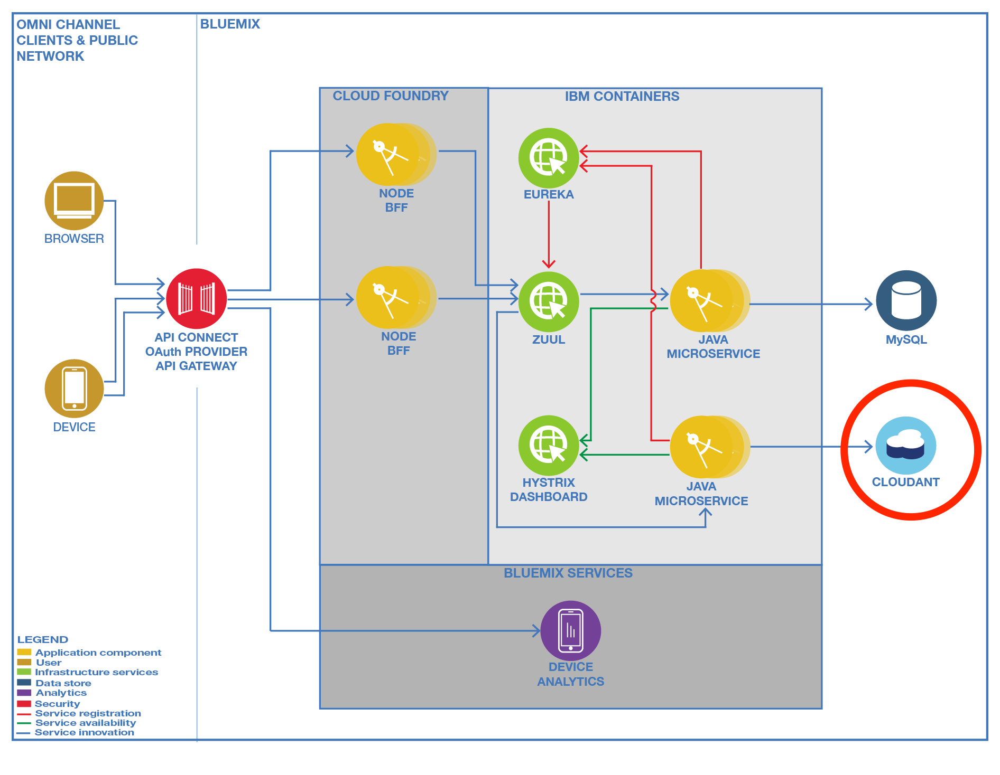
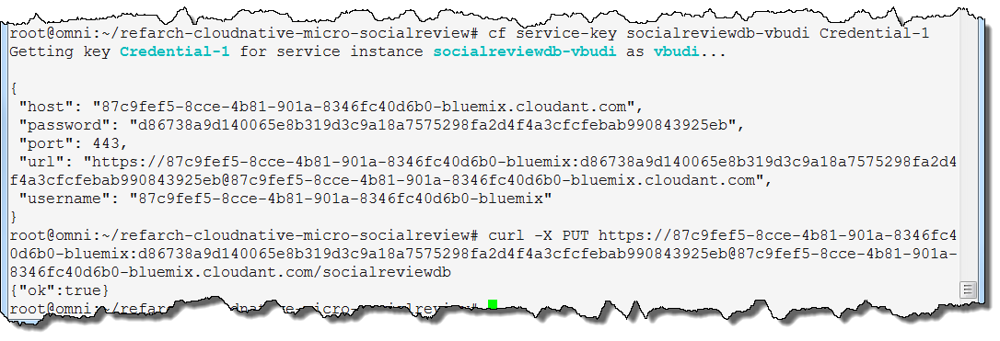
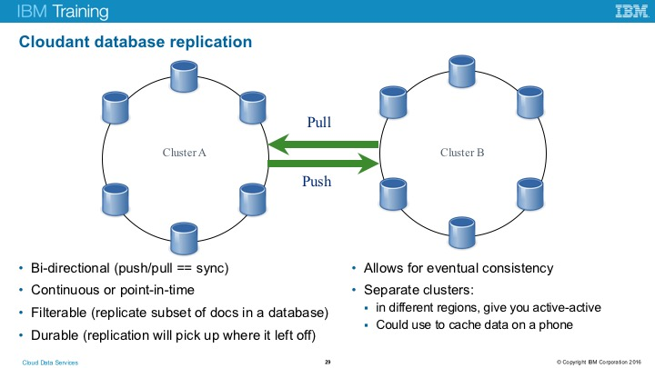
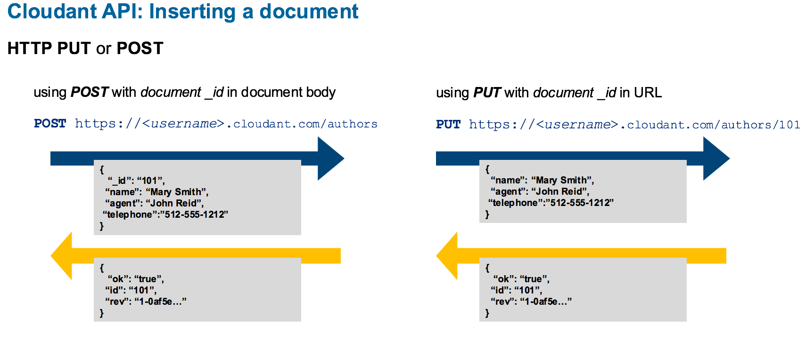
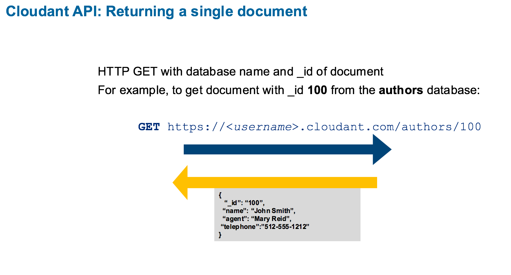

# Learning about Cloudant and thinking about NoSQL databases

<em>Expected outcome:</em> In this exercise you will think about creating a database to hold reviews from social media. You will work with the Cloudant database from the command line. At the completion of this exercise, you will have some experience working with a NoSQL database and thinking about how NoSQL data bases differ from relational databases. **Note:** This exercise is a prerequisite for creating the Social Media application.


In this exercise you will be setting up a database to capture reviews on social media. Your manager is very excited about the idea of microservices and has separated a large team of developers into smaller teams. Your team will be writing the "Social Media Review Microservice." Your team has named it "Social Review" for short. You have been asked by the scrum leader to layout the data that should be kept for social review. In the discussions and meetings leading up to now, it is always assumed that we know what goes into a review of a product, or a service, or ... in fact it isn't clear what the customers will be writing about. Oh and you need to have a plan for discussion tomorrow morning. It seems reasonable that reviews will contain large blocks of text.

  1. Where do you start?   
  2. How much text?
  3. What about ratings?
  
  Take a few minutes to think about this task. 


```


```
It is very likely that whatever data design you start with, it will change. Are you thinking in rows and columns? How about the idea of a blob somewhere? You also know that with changes will also come with demands for searching data. 

Clearly this thought experiment was designed to make you think about what you know about NoSQL databases. More importantly, it is meant to break you out of thinking about traditional relational databases. Other constraints and considerations could be applied here. 

- There is no existing data for this microservice
- This data is tightly coupled to the microservice.
- Data access performance is crucial.


In this exercise, you will create a Cloudant database to hold reviews for the microservice. Later, you will work on installing the social review microservice. The steps here are based on `https://github.com/ibm-cloud-architecture/refarch-cloudnative-micro-socialreview`.

## Prerequisites
You should have setup your working environment (command-line) prior to starting this exercise. This exercise references a command line tool called jq. jq describes itself as 'a lightweight and flexible command-line JSON processor.' You do not need jq to complete these exercises, but it is a useful tool for formatting the output when working with Cloudant.
 
 More information about jq can be found here: 'https://stedolan.github.io/jq/'


## Part 1: Defining a Cloudant database

**Note:**  In this exercise you will see '${SUFFIX}' This is a unique identifier for your database so that your database name does not collide with another Cloudant database on Bluemix. For this exercise you can either define a shell variable or you can just type the suffix for each command. 

1. Log into your Bluemix account.
TIP: Use `cf login -a <endpoint> -u <user> -o <org> -s <space>` 

2. Create a new Cloudant service for the Social Review microservice.

         # cf create-service cloudantNoSQLDB Lite socialreviewdb-${SUFFIX}
         # cf create-service-key socialreviewdb-${SUFFIX} Credential-1
         # cf service-key socialreviewdb-${SUFFIX} Credential-1

**Important:** When you create a database, you will receive a set of credentials. It is important that you write down these credentials. You may wish to set shell variables for each of these credentials. This exercise and subsequent exercises will refer to these credentials with this '${NAME}' notation.

  

3. Write down the credentials: 
    - url: ________________________________________  ${CLOUDANT_URL}
    - user: _______________________________________  ${CLOUDANT_USER}
    - password: ___________________________________  ${CLOUDANT_PASSWORD}
    - host: _______________________________________  ${CLOUDANT_HOST}
    
4. Use the URL to create database **socialreviewdb-${SUFFIX}**:

         # curl -X PUT ${CLOUDANT_URL}/socialreviewdb-${SUFFIX}

At this stage, your Cloudant database is ready. The Cloudant database does not need any information about the data structure. Now you can create the container that hosts the application. Again this application is based on the Spring framework.



Take a look at this diagram which shows Cloudant replication. What do you already know about the CAP theorem and Cloudant? (Hint: Cloudant guarantees Availability and Partition tolerance.) While Cloudant does not guarantee consistency, it does provide eventual consistency. 

####Eventual Consistency
Are you concerned that NoSQL databases do not provide consistency? Recall the CAP theorem. For our users, availability (the 'A' in CAP) trumps consistency. In addition, partition tolerance (the 'P' in the CAP theorem) is required. Partition tolerance says we will have distributed servers. Given these two requirements, consistency cannot be guaranteed. Think of real world examples such as booking a hotel, or airline reservation and you find examples of eventual consistency. 

A detailed discussion of eventual consistency can be found at: <http://guide.couchdb.org/draft/consistency.html> As usual, Wikipdia is a good reference on the subject: <https://en.wikipedia.org/wiki/CAP_theorem>


## Part 2: Work with your new NoSQL database
Now that you have created a NO SQL database, you should add some documents, retrieve documents, to get a better understanding of the API and how Cloudant stores documents.

Take a look at the Cloudant API for inserting a document:
--

--
1. Use a post to your new database to add a document.

```
$curl -X POST ${CLOUDANT_URL}/socialreviewdb-${SUFFIX} -H 'Content-Type: application/json' -d '{"review" : "This spaghetti is delicious."}'

{"ok":true,"id":"9bfb47681881ea877dfaec32da7eefaa","rev":"1-582af29b21293054f89204fc92928197"}

```

  Here is the call for getting a single document:

--

--

2. Read an individual by added the document id to the end of the URL.

```
curl ${CLOUDANT_URL}/socialreviewdb-${SUFFIX}/9bfb47681881ea877dfaec32da7eefaa

{"_id":"9bfb47681881ea877dfaec32da7eefaa","_rev":"1-582af29b21293054f89204fc92928197","review":"This spaghetti is delicious. I want to eat it all the time"}
```
3. Create some additional documents.


4. Add '/_all_docs' the the database URL to view all of your documents

```
$ curl ${CLOUDANT_URL}/socialreviewdb-${SUFFIX}/_all_docs

```
5. If you have installed the JSON parser (jq) you can pipe the output of the curl to jq. *Note:* There is a dot (period) after the jq. This step is not required, it just makes the JSON output easier to read.

```
$ curl ${CLOUDANT_URL}/socialreviewdb-${SUFFIX}/_all_docs | jq .
    % Total    % Received % Xferd  Average Speed   Time    Time     Time  Current
                                   Dload  Upload   Total   Spent    Left  Speed
  100   315    0   315    0     0   1509      0 --:--:-- --:--:-- --:--:--  1514
  {
    "total_rows": 2,
    "offset": 0,
    "rows": [
      {
        "id": "024c3167f246a56df1580bbd016e295b",
        "key": "024c3167f246a56df1580bbd016e295b",
        "value": {
          "rev": "1-9b43c475ddb63b403abc95be2ad3064b"
        }
      },
      {
        "id": "9bfb47681881ea877dfaec32da7eefaa",
        "key": "9bfb47681881ea877dfaec32da7eefaa",
        "value": {
          "rev": "1-582af29b21293054f89204fc92928197"
        }
      }
    ]
  }
```

6. Can you delete one of the the documents you created? Experiment with curl until you get the correct command. When you are done you should leave the 'spaghetti review' document in the database.

**Hint:** The Cloudant API is a RESTful API. In REST the action is defined by the protocol. Therefore an HTTP POST is an insert, an HTTP GET is a read, an HTTP PUT is an update, and an HTTP ____ is a delete.

**Additional Hint:** If you get a 'conflict error' then the delete URL should include the revision number.

```
{
  "error": "conflict",
  "reason": "Document update conflict."
}

```

Add '?rev=' and the revision number to the end of the delete URL. Remember to use \ for special characters.  

```
curl -X DELETE ${CLOUDANT_URL}/socialreviewdb-${SUFFIX}/9bfb47681881ea877dfaec32da7eefaa\?rev=1-582af29b21293054f89204fc92928197 | jq
  % Total    % Received % Xferd  Average Speed   Time    Time     Time  Current
                                 Dload  Upload   Total   Spent    Left  Speed
100    95  100    95    0     0    413      0 --:--:-- --:--:-- --:--:--   414
{
  "ok": true,
  "id": "9bfb47681881ea877dfaec32da7eefaa",
  "rev": "1-582af29b21293054f89204fc92928197"
}
```


6. Why do you think every document has a rev field? How could this be important for a database with eventual consistency?

Here is a reference to the complete Cloudant API, with examples using curl: <https://docs.cloudant.com/api.html>

