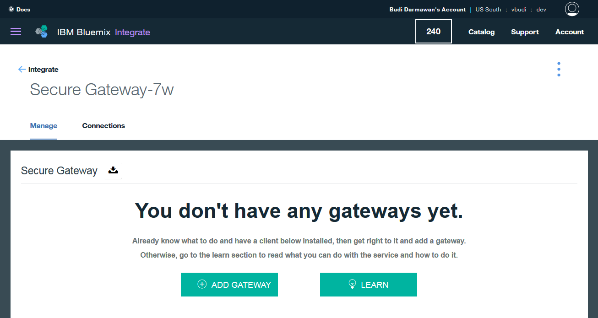
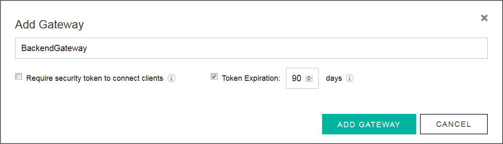
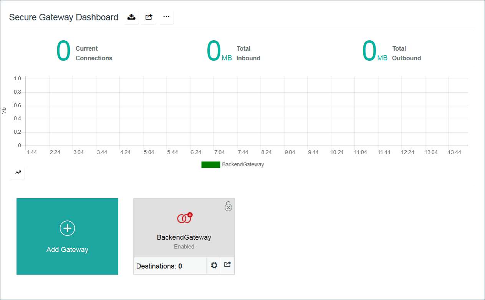
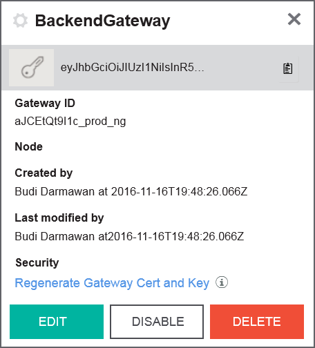

# Implement secure gateway  

The exercises for this unit describe how to provision and configure a Bluemix secure gateway service so that applications can connect to on-premises resources. This exercise is part of the overall exercise to establish a connection to an on-premises mysql database for the inventory microservice.

Expected outcome: The secure gateway is configured for the Bluemix organization that you are using. This exercise is a pre-requisite to the secure gateway client and mysql exercises. The expected duration for this exercise is 15 minutes.

## Exercise 1: Creating the Secure Gateway service

Perform the following steps to create the Secure Gateway service:

1. Go to Bluemix: `https://bluemix.net` and login with your IBM id and password.
2. Select __Catalog__ from the menu.
3. In the filter field at the top of the page, search for `Secure Gateway`. 

3. Click on the Secure Gateway tile.
3. Click __Create__ at the lower right area of the page.
4. The Manage Secure Gateway page opens. Verify that you see the message `You dont have any gateways yet`.

## Exercise 2: Defining gateway

Perform the following steps to define the Gateway:

1. From the Manage Secure Gateway page, click __ADD GATEWAY__.
2. In the Add Gateway dialog, specify the name of `BackendGateway` and uncheck the `Require Security token to connect clients` option.

2. Click __ADD GATEWAY__.
3. In the Secure Gateway dashboard, notice that now you have the BackendGateway tile that has two red rings. Those red rings mean that the gateway is not connected to any client.

3. Click on the Settings icon on the BackendGateway tile to open the properties page. Take note of the Gateway ID. The Secure Gateway client will need this information to connect to the gateway.

Gateway ID: _________________________________________
5. Close the proerties dialog

This concludes the secure gateway exercise.
