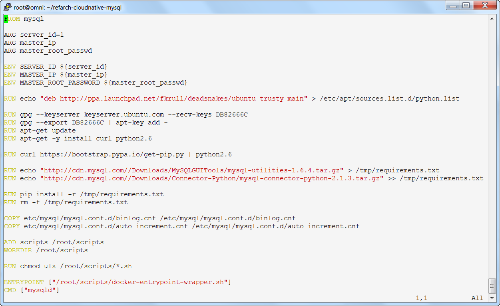
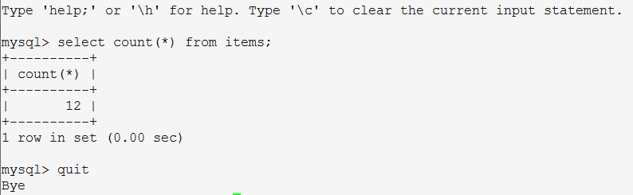
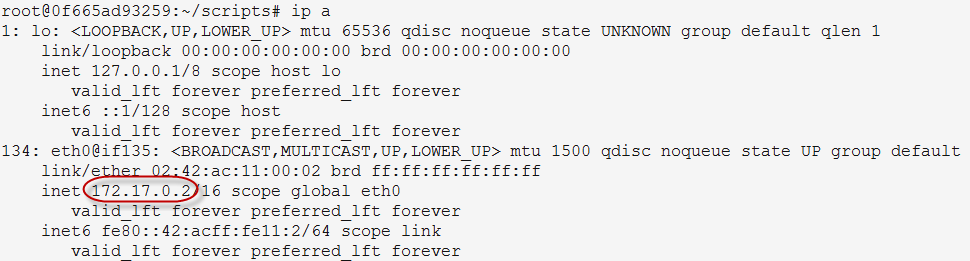

# Build mysql container with secure gateway client

The exercise is aimed to simulate a backend on-premise environment that hosts the inventory mysql database in a container. You will also create the secure gateway client on a container to connect the local environment to the public Bluemix using a secure gateway.

_Expected result_: At the end of this exercise you should have 2 containers running locally, the mysql and secure gateway client. You should have the inventorydb populated and a connection from Bluemix using the secure gateway. The output from this lab is the mapped IP address and port for the local mysql environment. This lab is estimated to run for 1 hour.

## Exercise 1: Building the mysql container

The backend on-premise environment is built as a container. The instruction is based on the mysql container from the BlueCompute application from: [https://github.com/ibm-cloud-architecture/refarch-cloudnative-mysql](https://github.com/ibm-cloud-architecture/refarch-cloudnative-mysql "https://github.com/ibm-cloud-architecture/refarch-cloudnative-mysql").

The backend will run on your local docker environment. The on-premise environment is not deployed to Bluemix.

1. First you must clone the git repository (ignore this step if you already run the clonePeer.sh to clone all the GIT repository for BlueCompute).

        # git clone https://github.com/ibm-cloud-architecture/refarch-cloudnative-mysql

2. Go to the cloned directory

        # cd refarch-cloudnative-mysql

3. Evaluate the Dockerfile.

    

    These are the summary on what it is doing:
   -  Using the mysql container from DockerHub
   -  Uses server\_id, master\_ip and master\_root\_password (which are used to create a replication cluster for resiliency; these values can be ignored in this single instance environment)
   -  Install curl and python 2.6
   -  Install mysql python connector and mysql utilities
   -  Load scripts, set default path and set file permissions
   -  Specify to initialize the container using docker-entrypoint-wrapper.sh and run mysqld

4. Build the image using the Dockerfile. (Note: you must define SUFFIX environment variable, which will uniquely identify your resources compared to other students such as `export SUFFIX="abcdef"`)

        # docker build -t mysql-${SUFFIX} .

5. Use the `docker run` command to execute the image as docker container. You initialize the MYSQL database engine using the environment variables as listed. You can change the passwords, but be sure to remember what the password that you use.

        # docker run -m256M -p3306 --name mysql \
           -e MYSQL_ROOT_PASSWORD=Pass4Admin123 \
           -e MYSQL_USER=dbuser \
           -e MYSQL_PASSWORD=Pass4dbUs3R \
           -e MYSQL_DATABASE=inventorydb \
           mysql-${SUFFIX}

6. Define and load the tables for the Inventory database:

        docker exec -it mysql sh load-data.sh

7. Verify that the data is loaded properly (use the password that you use for MYSQL_PASSWORD environment variable before). You should have 12 rows in the table.

	    # docker exec -it mysql bash
	    root@instance-823719832> mysql -udbuser -pPass4dbUs3R inventorydb
	    mysql> select count(\*) from items;
	    mysql> quit

    

8. Still in the bash session, get the IP address of the container using the `ip a` command.

    

     IP address: _______________________

9. Type `exit` in the bash session to the mysql container to get back to the main session.

## Exercise 2: Building the secure gateway client container

In this exercise, we decide to use the Docker container implementation for the Secure Gateway client. You can also install the client in the mysql container, but for containers it is preferable to run them for a single purpose. Although taPower appliance is the recommended way to run the client in the production environment, this container based client is easier to understand and use.

1. Download the secure gateway client from Docker Hub.

        # docker pull ibmcom/secure-gateway-client

2. Run the secure gateway client container. Note that the gatewayID must be substituted with gateway that you created in the Secure Gateway exercise.  

        # docker run --name sgclient -m 256M -it ibmcom/secure-gateway-client <gatewayID>

3. In the prompt that ensures, open port 3306 using the command `acl allow :3306`

## Exercise 3: Creating destination to connect to mysql

Now that the client has been defined, you can go to the Bluemix interface to define the gateway destination.

1. Open the Bluemix dashboard in [http://console.ng.bluemix.net](http://console.ng.bluemix.net "http://console.ng.bluemix.net").
2. Click on the __Secure Gateway__ service to open the manage interface.
3. Click on the __BackendGateway__ tile. Note that the circles should now be Green indicating that a client has been connected to the gateway.
4. Click the __Add Destination__ tile.
   - Select On-Premises and click __Next__.
   - Specify your IP address of the MySQL container from exercise 1 and port of 3306 and click __Next__.
   - Use TCP protocol and click __Next__.
   - Specify the None for the authentication and click __Next__.
   - Skip the list of source IPs and ports and click __Next__.
   - Select the name of MySQL and click __Finish__.
5. Click on the Gearbox icon for the MySQL destination tile.

    From there you should collect the Cloud Host:Port information to be used when defining the inventory microservice application.

    Cloud destination: _______________________________________________________________________
