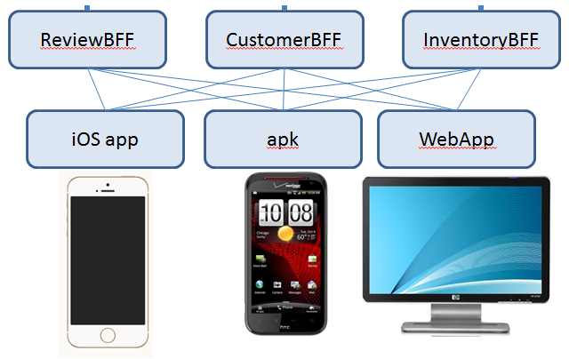

# Designing Microservices lab #

This lab is designed to be an thought exercise, with no real structure prescribed. The total length of session is around 1 hr with no actual coding. The practical hands on can be performed using the BlueCompute application.  

1. Illustrating goal: __online store application__
   - The application in its infancy will build a bare minimum system
   - Some of the given are: 
      - the inventory is stored in the corporate SQL database and wont be changed in the near future.
      - user review of the product is one of the important feature that is expected to be available in the first iteration of the product.
   - Discuss some of the design considerations and boundary:
     - Some of the goods are quite expensive financing is an option
     - Shipping can take a large portion of the cost 
2. Define microservices: 
   - What are the possible breakdown of the services?
   - Discuss how the microservices can be dependent on each other
   - Discuss how the API would look like roughly 
   - The following diagram is the suggessted structure that this guide is following. There can be other implementations 
   
   - Inventory: 
	   - `GET /inventory/<itemId>`
	   - `PUT /inventory/<itemId>`
	   - `POST /inventory`			<-- JSON input 
	   - `GET /inventory`
	   - `DELETE /inventory/<itemId>`
   - Social review
	   - `POST /flight/list/<origin>/<dest>/<date>`   <-- array of Flight info
	   	 - Flight info = { itinieraryId , fare , [ orig, origin-time, dest, dest-time, Flightnum ], numseat: int } 
	   - `POST /flight/book/<origin>/<dest>/<date>` <-- flight info
   - Ordering
	   - `GET /booking/<custId>` 
	   - `POST /booking/<custId>` <-- flightInfo + #numBook this will
	   - `PUT /booking/<custId>/<bookingId>`
	   - `GET /booking/<custId>/<bookingId>`
	   - `DELETE /booking/<custId>/<bookingId>` 
   - Financing 
   - Customer 
3. Add framework and compute options
   - Service discovery and proxy: Amalgam8 - Eureka
   - Circuit Breaker: Hystrix
   - Compute technology: Container - CF apps
   - Programming language (polyglot?): Node.js - Java - PHP
   - Persistent layer: API call - NoSQL - SQL
   
4. Define front-end components (platform, language, requirements): Discuss the following:
   - BFF: why do you need a BFF? what the BFF do? 
   - Mobile: ios - android
   - Web based
   - API management needed? benefit/limitation
   
6. Security considerations
   - logging in: OAuth - SSO
   - intra component communication: JWT
   - Backend interface, connectivity: Secure Gateway - VPN
    
7. DevOps thinking: Discuss the following topics to adhere to 12-factors and other design topics
   - GIT repository
   - Pipeline development
   - Slack notification
   - Test suite (Sauce lab - App Security - homegrown)
   
8. Resiliency: Discuss the techniques for doing resiliency across multiple data centers, database replication and load balancing (Dyn, Akamai etc)
   - Failover - load balancing
   - Disaster recovery - site switching